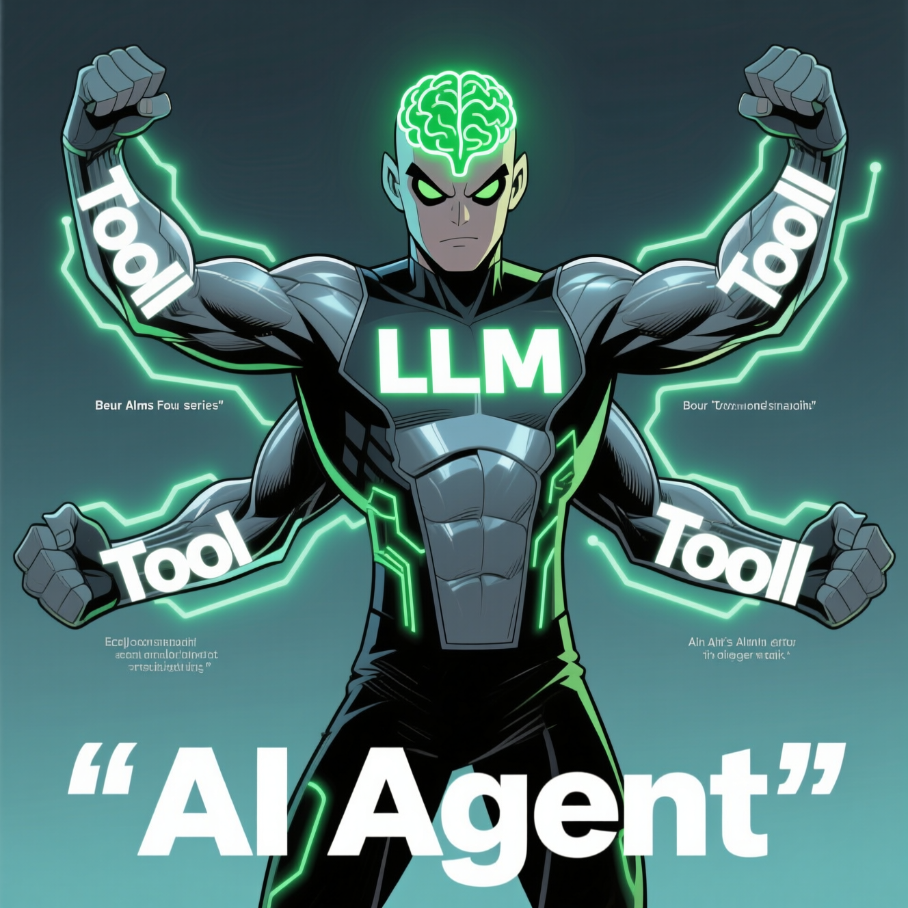

# AI_agents_from_scratch

---

# Understanding Agents: The Fundamentals

This section provides a foundational understanding of what an **Agent** is, a concept that is currently "everywhere" across platforms like LinkedIn, Twitter, and Medium. Thanks to frameworks such as LangChain, LlamaIndex, and CrewAI, building functional agents has become accessible with minimal code. However, it's crucial to understand what truly happens "under the hood".

## What is an Agent?
At its core, an **agent is essentially a set of functionalities or abstractions layered on top of a Large Language Model (LLM)**. Without the powering LLM, the agent would be "useless". You can think of the LLM as the agent's "brain", but like a brain, it needs additional components to interact with the external world.

## Key Components of an Agent
To function effectively, an agent combines its LLM "brain" with several crucial components:

*   **LLM (The Brain)**: This is the fundamental component, the "brain" that powers the entire agent.
*   **Planning Capabilities**: These allow an agent to **break down complex tasks into smaller ones, manage subgoals, and even reflect on its results and perform self-criticism**. There is a growing array of techniques for planning and reasoning, including:
    *   Chain of Thoughts (CoT)
    *   CoT-SC
    *   Tree of Thoughts (ToT)
    *   **ReAct**: Highlighted as "one of the most important planning techniques".
*   **Memory Capabilities**: An agent needs to "remember" previous thoughts or interactions. This can be categorized into:
    *   **Short-term memory**: For an LLM, this primarily corresponds to its **context window**.
    *   **Long-term memory**: This allows the agent to **retain information for a (potentially) infinite amount of time** and access information not stored in the LLM's weights. **Vector Databases** such as Qdrant, Weaviate, or Pinecone are excellent examples of solutions for long-term memory.
*   **Tools**: These enable the agent to **interact with the external world**. With tools, an agent can:
    *   Call external APIs and services to retrieve information missing from its model weights (e.g., current events).
    *   Act on external systems (e.g., adding data to a database).

## Conclusion
Despite the hype, agents are fundamentally "pretty simple". All that's required is an **LLM as the "brain," a mechanism to reason (planning), a way to "remember" things (memory), and tools to interact with the external world**. This understanding forms "Lesson 0" of a series designed to explore agentic patterns from scratch, covering both theory and practical implementation.

---

---